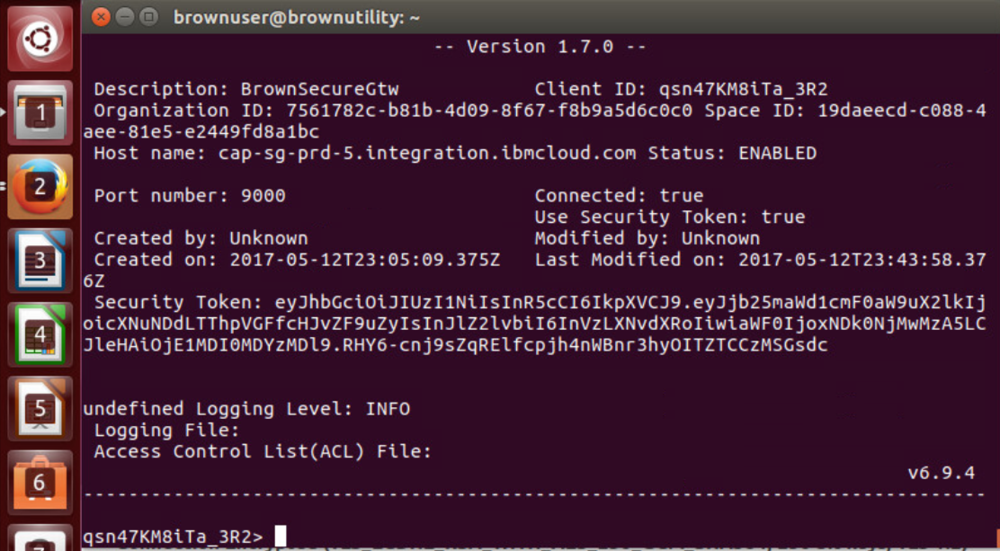
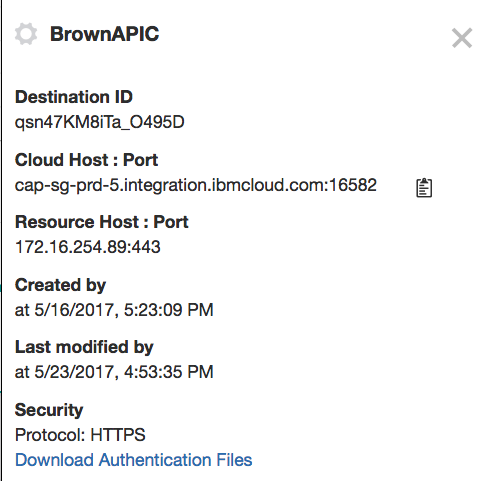
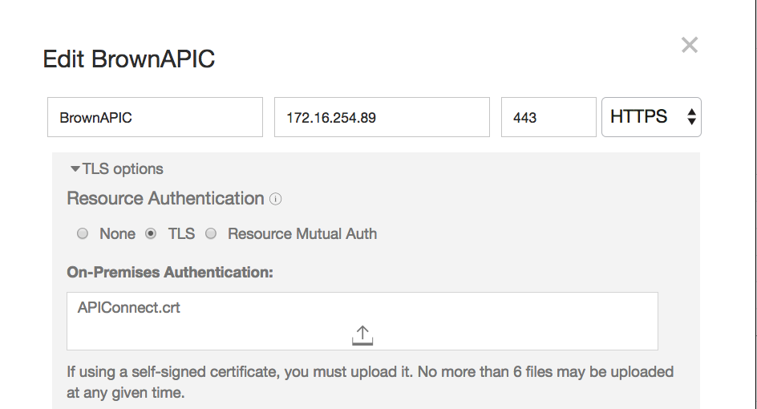

[IBM Secure Gateway Service](https://console.ng.bluemix.net/docs/services/SecureGateway/secure_gateway.html) provides secure connectivity and establishes a tunnel between your Bluemix organization and the remote location that you want to connect to.

## Steps to perform
The following diagram illustrates what needs to be done to setup secure connection between Bluemix application and an on-premise end point being an API Connect exposed API.


1. In your Bluemix account / organization create a IBM Secure Gateway service using the path Catalog> Integrate > Secure Gateway.  In the diagram below the service is named "Secure Gateway-p4".

 Add one instance of gateway (e.g. named BrownSecureGtw), using security token and token expiration options. In the Bluemix Secure Gateway service >  Manage menu access the Dashboard user interface, and then the settings menu (via the gear icon):  
   

 to access the server details:  
 

 The security token key string and the Gateway ID are needed for the secure gateway client settings you will do later.

2. On the on-premise server install one of the secure gateway client. During development and for convenience we picked up the Docker image by performing the following steps.

 ```
# download the docker image
$ sudo docker pull ibmcom/secure-gateway-client
# Verify the docker images
$ docker images
# then start the secure gateway client using the command
$ sudo docker run -P -it ibmcom/secure-gateway-client <secure-gateway-id> -t <token-string>
# to see the client process running                                  
$ ps -ef
# to reconnect to the secure gateway client
$ docker ps -a
$ docker attach <docker id>
# to restart a container
$ docker restart <dockerid>
```  
The following image presents the secure gateway client command line interface with the results from the command "C 1" to display the configuration
  

 The prompt  string represents the unique identifier of the client, it will be visible on the Bluemix Secure Gateway dashboard when the client is connected.

 For production deployment, the tests illustrate some performance challenges with docker image, so direct installation of the secure gateway client based on the operation is a better option. To do so see the specific [note](intall_linux_client.md)

3. Back to the dashboard the client should be visible in the list of connected client. The client id should match the id returned by the docker run as illustrated below (the string with _3R2)

 The client makes a connection to the service instance running in bluemix and then open a bi-directional tunnel so data can be sent from a Bluemix app to the on-premise server. In the case of this integration, the server is the API Connect gateway running on IP 172.6.254.89:443.

 Use the add destination from the Dashboard, and follow the step by step wizards
 

 Once done the new destination is added, and using the gear icon it is possible to access the detail of the destination. One important elements is the cloud host name that is needed for the bluemix app to call the on-premise app.
 

4. When the client is set up and running, we need to add destination for the on-premise application end-point. You need to gather a set of information for your end points:
 * The IP address or host name
 * The type of protocol to support, HTTS or
 * any user authentication credentials used to access the service.

 The example below is a simple nodejs script to do a HTTP request to the bluemix proxy. The headers settings are coming from the API Connect configuration. (See []())
```javascript
request.get(
    {url:'https://cap-sg-prd-5.integration.ibmcloud.com:16582/csplab/sb/sample-inventory-api/items',
    timeout: 10000,
    headers: {
      'x-ibm-client-id': '1dc939dd-c8dc-4d7e-af38-04f9afb78f60',
      'accept': 'application/json',
      'content-type': 'application/json'
      }
    },
```

 What is important to understand that the cap-sg-prd-5... is a public server, so it is possible to use curl to test the connection outside of any app code.
  ```

  ```

5.Download the Certificate  
 The connection between bluemix app to back end data access service needs to be over HTTPS, HTTP over SSL. To make SSL working end to end we need to do certificate management, configure trust stores, understand handshaking, and other details that must be perfectly aligned to make the secure communication work. SSL uses public key/private key cryptography to encrypt data communication between the server and client, to allow the server to prove its identity to the client, and the client to prove its identity to the server.

 Three fundamental components are involved in setting up an SSL connection between a server and client: a certificate, a public key, and a private key. Certificates are used to identify an identity: (CN, owner, location, state,... using the X509 distinguished name) Entity can be a person or a computer. As part of the identity, the CN or Common Name attribute is the name the server uses to identify the domain name of the host.

 To establish a secure connection to API Connect server, a client first resolves the domain name as specified in CN. After the SSL connection has been initiated, one of the first things the server will do is send its digital certificate. The client will perform a number of validation steps before determining if it will continue with the connection. Most importantly, the client will compare the domain name of the server it intended to connect to (in this case, 172.26.254.89) with the common name (the “CN” field) found in the subject’s identity on the certificate. If these names do not match, it means the client does not trust the identity of the server.

 Public keys and private keys are number pairs with a special relationship. Any data encrypted with one key can be decrypted with the other. This is known as asymmetric encryption. The server’s public key is embedded within its certificate. The public key is freely distributed so anyone wishing to establish an encrypted channel with the server may encrypt their data using the server’s public key. Data encrypted with a private key may be decrypted with the corresponding public key. This property of keys is used to ensure the integrity of a digital certificate in a process called digital signing.

 ```
# get certificate in the form of a .crt file, then mv it to ca-certificate
$ sudo mv APIConnect.crt /usr/local/share/ca-certificate
# To add en try to the certificates use the command
$ sudo update-ca-certificates
# verify with
$ ls -al /etc/ssl/certs | grep APIConnect
$ openssl s_client -showcerts -connect 172.16.254.89:443
```

6.Add certificate to destination  
Save the certificate as file, (e.g. APIConnect.crt) and then upload it in the destination configuration of the Secure Gateway Bluemix Service.



## References
* [Bluemix Secure Gateway Service Documentation](https://console.ng.bluemix.net/docs/services/SecureGateway/secure_gateway.html)
* [Reaching Enterprise Backend with Bluemix Secure Gateway via SDK API](https://www.ibm.com/blogs/bluemix/2015/04/reaching-enterprise-backend-bluemix-secure-gateway-via-sdk-api/)
* [Reaching enterprise backend with Bluemix Secure Gateway via console](https://www.ibm.com/blogs/bluemix/2015/04/reaching-enterprise-backend-bluemix-secure-gateway/)
* Real life experience with Secure Gateway
[part 1](https://www.ibm.com/blogs/bluemix/2015/11/secure-gateway-in-production-part1/)
[part 2](https://www.ibm.com/blogs/bluemix/2015/11/secure-gateway-in-production-part2/)
* [](https://www.ibm.com/blogs/bluemix/2015/05/bluemix-hybrid-integration/)
