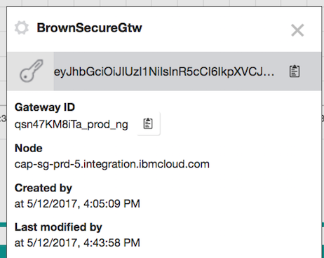

# Use IBM Cloud Continuous Delivery service to deploy to IBM Cloud Private
This article addresses in details how to configure IBM Cloud to connect to IBM Cloud Private (ICP) and configure a deployment of a containerized application to ICP using an IBM Cloud Continuous Delivery toolchain. IBM Cloud services required for this integration include:
[IBM Secure Gateway Service](https://console.ng.bluemix.net/docs/services/SecureGateway/secure_gateway.html) (SG) provides secure connectivity and establishes a tunnel between your Bluemix organization and the remote location that you want to connect to. Remote locations could be other cloud platform or on-premise resource. 

[IBM Continuous Delivery Service] (https://console.bluemix.net/catalog/services/continuous-delivery) (CD) provides custom and template toolchains to execute a continuous delivery pipeline for your application delivery needs. 


In this implementation we have an on-premise installation of IBM Cloud Private which will serve as the deployment target for a containerized application that has been developed on IBM Cloud, using CD services.

The alternate to secure connection between application deployed on public cloud and on-premise servers is to use VPN.


## Table of Contents
* [Goal](https://github.com/ibm-cloud-architecture/refarch-integration-utilities/blob/master/docs/DeployFromIBMCloudToICP.md#goal)
* [Pre-requisites](https://github.com/ibm-cloud-architecture/refarch-integration-utilities/blob/master/docs/DeployFromIBMCloudToICP.md#pre-requisites)
* [Configuration steps](https://github.com/ibm-cloud-architecture/refarch-integration-utilities/blob/master/docs/DeployFromIBMCloudToICP.md#steps-to-perform)
* [Update certificates](https://github.com/ibm-cloud-architecture/refarch-integration-utilities/blob/master/docs/DeployFromIBMCloudToICP.md#update-certificates)
* [References](https://github.com/ibm-cloud-architecture/refarch-integration-utilities/blob/master/docs/DeployFromIBMCloudToICP.md#references)

## Goal
The desired outcome will have an IBM Cloud Continuous Delivery toolchain deploy a Docker container into a Kubernetes cluster hosted in IBM Cloud Private (ICP). The connection from the IBM Cloud to ICP has to be secure end to end. A TLS mutual auth between the IBM Cloud CD app to the secure gateway, and TLS between ICP and secure gateway will be configured.
  

## Pre-requisites
You need to have
* an IBM Cloud account
* a server, linux based, within the same network as the ICP instance you want to integrate with.
* administration privileges on this server (root or able to sudo)


## Steps to perform
The following diagram illustrates what needs to be done to setup secure connection between the IBM Cloud CD toolchain application and the ICP Kubernetes cluster.


### Step 1- Create secure gateway service in Bluemix
In your Bluemix account / organization create a IBM Secure Gateway service using the path Catalog> Integrate > Secure Gateway.  In the diagram below the service is named "Secure Gateway-p4".

 Add one instance of gateway using the + icon (e.g. named BrownSecureGtw),


 select security token and token expiration options.


 Double click on the newly created gateway, so you can access the gateway **dashboard** from where you should be able to add client, destination and see the gateway parameters.  


For example, via the settings menu (the gear icon on the right side of the gateway name), you should be able to access the gateway details:  
 

 The `security token key` string and the `Gateway ID` are needed when you will configure the secure gateway client (see next [section](https://github.com/ibm-cloud-architecture/refarch-integration-utilities/blob/master/docs/ConfigureSecureGateway.md#step-2--configure-secure-gateway-client-server)). The `Node` is the name of the server you will use from the IBM Cloud CD toolchain app to connect to the gateway. 

### Step 2- Configure secure gateway client server
On the on-premise server deployed in a DMZ zone (ICP), install one of the secure gateway client: docker image or OS specific client.

Using your Web browser, within the Secure Gateway Dash board > Select `+ Connect Client` button:
 

select one of the installers provided:  


`Remark: the Gateway ID and Security token in this screen match the detail parameters of the secure gateway`.

#### Docker
During development phase and for convenience, you may want to pick up the Docker image by performing the following steps.

 ```
# download the docker image
$ sudo docker pull ibmcom/secure-gateway-client
# Verify the docker images
$ docker images
# then start the secure gateway client using the command
$ sudo docker run -P -it ibmcom/secure-gateway-client <secure-gateway-id> -t <token-string>
# to see the client process running                                  
$ ps -ef
# to reconnect to the secure gateway client
$ docker ps -a
$ docker attach <docker id>
# to restart a container
$ docker restart <dockerid>
```  
The following image presents the secure gateway client command line interface with the results from the command `CLI> C 1` to display the configuration information  

  

The prompt  string represents the unique identifier of the client, it will be visible on the IBM Cloud Secure Gateway dashboard when the client is connected.


#### Direct install
For production deployment, the tests illustrated some performance challenges with docker image, so we decided to directly install the Secure Gateway Client for Ubuntu. The steps are defined in the [product documentation](https://console.bluemix.net/docs/services/SecureGateway/sg_025.html#sg_025). Here is a quick summary for the steps performed:  

In the software installer section, select your target OS, it should download the installer file. Then do the following:  

* Install the client code using the following command on **Ubuntu**. Be sure to be root user or a user who is part of the *sudoers*.

```
sudo dpkg -i ibm-securegateway-client-1.4.1+client_amd64.deb
```
For **RedHat 7.x**:
```
rpm -ivhf --force ibm-securegateway-client-1.4.1+client_amd64.rpm
```
During the installation the following information are needed:
 * **gateway ID**: it can be found in IBM Cloud Secure Gateway instance
 * **security token**: it is also available in the Secure Gateway instance
 * if you want to start the secure gateway automatically or not
 * Specify the trace level: information
 * Specify the Access Control List (ACL) file: specify none for the moment.
 * Provide the port number for the web based user interface: 9003

The command adds a *secgwadmin* group and the *secgwadmin* user, and persists the configuration in the file `/etc/ibm/sgenvironment.conf`. It also defines some links to `/usr/local/bin` so the secure gateway client can be started from command line.

Verify the configuration, the connection and the port number the user interface is using
```
cat /var/log/securegateway/client_console.log

IBM Bluemix Secure Gateway Client Version 1.7.0

[INFO] (Client ID 1259) No password provided. The UI will not require a password for access
[WARN] (Client ID 1259) UI Server started. The UI is not currently password protected
[INFO] (Client ID 1259) Visit localhost:9003/dashboard to view the UI.
[INFO] (Client ID 1735) Setting log level to INFO
[INFO] (Client ID 1735) The Secure Gateway tunnel is connected
[INFO] (Client ID qsn47KM8iTa_6pQ) Your Client ID is qsn47KM8iTa_6pQ
(Client ID qsn47KM8iTa_6pQ) Synchronizing ACL rules

```

To stop the client use the systemctl command like:  

`sudo systemctl stop securegateway_client`

and to disable at system boot time

`systemctl disable securegateway_client`

To get the status of the secure gateway on the server run the command:
` systemctl status securegateway_client`

then to restart: `sudo systemctl start securegateway_client`

Here is an example of trace:
```
brownuser@brownutility:/var/log/securegateway$ systemctl status securegateway_client
 securegateway_client.service - IBM Secure Gateway Client for Bluemix
   Loaded: loaded (/lib/systemd/system/securegateway_client.service; enabled; vendor preset: enabled)
   Active: active (running) since Wed 2017-06-14 17:10:26 PDT; 26s ago
  Process: 5682 ExecStop=/bin/bash -c /usr/local/bin/securegateway_clientd stop (code=exited, status=0/SUCCESS)
 Main PID: 5750 (securegateway_c)
    Tasks: 22 (limit: 4915)
   Memory: 62.2M
      CPU: 1.172s
   CGroup: /system.slice/securegateway_client.service
           ├─5750 /bin/bash /usr/local/bin/securegateway_clientd start
           ├─5766 /bin/bash /usr/local/bin/securegateway_clientd start
           ├─5767 sgclient_parent
           └─5774 sgclient_qsn47KM8iTa_qpJ

Jun 14 17:10:26 brownutility systemd[1]: Started IBM Secure Gateway Client for Bluemix.
Jun 14 17:10:26 brownutility bash[5750]: Performing start operation

```

It is also possible to verify the connection using a Web Browser a the url https://locahost:9003/dashboard on the client host
  

The Client ID should match the ID on the gateway server in IBM Cloud. Same for the Gateway ID.

### Step 3- Define destination for secure gateway service
In IBM Cloud Console, back to the Secure Gateway dashboard, the client should be visible in the list of connected clients.
 

The client id should match the id returned by the secure client trace as illustrated below (the string with _PBB)

The client makes a connection to the service instance running in IBM Cloud and then opens a bi-directional tunnel so data can be sent from a Bluemix app to the on-premise server. In the case of this integration, the server is a SG client in an ICP vm running on IP 172.16.50.8:443. If you want to use a hostname instead of IP address, you need to understand that, there is no DNS resolution in the Secure Gateway in IBM CLoud. The host, that the gateway client is running on, needs to be able to resolve the hostname of the endpoint.

 Use the add destination from the Dashboard,
 

and follow the step by step wizards:
* This is an on-premise destination as the ICP Kubernetes cluster runs there
* Specify the security connection type between the client and the secure gateway and then between the secure gateway client and the final destination. The following figure illustrates one potential settings (TLS mutual auth between IBM Cloud CD app and secure gateway, and TLS between destination and secure gateway):   


Once done the new destination is added, and using the gear icon it is possible to access the detail of the destination configuration.
The TLS options below presents the settings of the previous high level view.  

So we need to update the certificate. The `apicgw.pem` is a file created by executing the following command on any server/host where the ICP Kubernetes cluster can be reached (IP address in this example of 172.16.50.8):
```
echo | openssl s_client -connect 172.16.50.8:443 -showcerts 2>&1
| sed  -n '/BEGIN CERTIFICATE/,/-END CERTIFICATE-/p'> apicgw.pem
```

This file is then uploaded to the Destination definition inside the gateway dashboard as illustrated in figure above.

It is important that you keep the **Cloud Host** name, as it is needed within the IBM Cloud CD app code, when defining end point of the on-premise service: the app goes to the gateway. Each destination (=endpoint) created in the Secure Gateway service will have a unique cloud host and Port.   


The IBM Cloud Secure Gateway server provides a set of certificates. Download the authentication files from the detail view. It is a zip file containing the TLS certificates.  The following table illustrates what to do with those files:

| File  | Intent |  Usage  |
| ----- | ------ | --- |
| apicgw.pem | Certificate from destination host | It was uploaded in Secure Gateway Destination definition |
| qsn47KM8iTa_clientCert.pem | certificate for client | We selected auto-generate to automatically create a self-signed certificate/key pair. This is one of the file. See note below|
| qsn47KM8iTa_clientKey.pem | private key for a client | Needed as input for the key store on client side |
| DigiCertCA2.pem | Certificate Authority certificate | Needed to add it to client trust store |
| DigiCertTrustedRoot.pem | Secondary CA certificate | Needed to add it to client trust store |
| secureGatewayCert.pem | Secure Gateway certificate | Also needed to add to client trust store|
| ----- | ------ | -- |


All those files are saved in the repository under ssl folder. For security reason they are not pushed into git.

The client certificate and client key are used to create a key store with a command such as:

```
openssl pkcs12 -export -in "./ssl/qsn47KM8iTa_O495D_destCert.pem" -inkey "./ssl/qsn47KM8iTa_O495D_destKey.pem" -out "ssl/sg_key.p12" -name "CaseIncCliCert" -noiter -password pass:"asuperpwd"
```
See detail on the [TLS note here](https://github.com/ibm-cloud-architecture/refarch-integration/blob/master/docs/TLS.md)

### Step 4- Create an IBM Cloud Container Cluster
See [Getting started with IBM Cloud Container Service] (https://console.bluemix.net/docs/containers/container_index.html#container_index)
Note: this may take time, before continuing beyond this step, execute the following command to ensure the IBM Cloud Container cluster is in "ready" state.
```
bx cs clusters
```

### Step 5- Create an IBM Cloud Container Registry & Namespace
See "Set up a namespace" in [Getting started with IBM Cloud Container Registry] (https://console.bluemix.net/docs/services/Registry/index.html#registry_namespace_add)

### Step 6- Create an IBM Cloud API Key
See [Managing user API keys] (https://console.bluemix.net/docs/iam/userid_keys.html#creating-an-api-key)
Be sure to record the API Key token for later use.

### Step 7- Create an IBM Cloud Continuous Delivery service
Adopt a DevOps approach by using IBM® Cloud Continuous Delivery, which includes open toolchains that automate the building and deployment of applications. You can get started by creating a simple deployment toolchain that supports development, deployment, and operations tasks.

After you create an instance of Continuous Delivery by selecting it from the IBM Cloud catalog, you can create a continuous delivery toolchain from a template or work with existing toolchains. 


### Step 8- Create an IBM Cloud Continuous Delivery toolchain
To create and configure a continuous delivery toolchain from a template, click [Start here] (https://console.bluemix.net/docs/services/ContinuousDelivery/index.html#starting_from_a_toolchain_template). The toolchain integrates tools for planning, developing, deploying pipelines, and managing your applications. 
Select the "Develop a Kubernetes App" template
In the Tool Configuration section at the bottom, Click on the "Delivery Pipeline" integration
Use API Key, Namespace and Cluster created in steps 4-6
Create Toolchain.

### Step 9- Configure an IBM Cloud Continuous Delivery toolchain
View the toolchain and click on the "Delivery Pipeline" card in the pipeline.
There will be 3 stages "Build", "Validate", "Deploy" that represent the deployment of a "hello-service" to the IBM Cloud cluster created in Step 4.
Click "Add Stage" to add an additional stage in the pipeline to deploy the same application to ICP.
Name the Stage "DEPLOY to IBM Cloud Private"
Add a new Job "Deploy to Kubernetes"
Deployer Type: Kubernetes
IBM Cloud Region: US South
API Key: <use value in Step 6>
Cluster Name: <use value in Step 4>
Deploy Script:
```
#!/bin/bash
#set -x

#Connect to a different container-service api by uncommenting and specifying an api endpoint
#bx cs init --host https://us-south.containers.bluemix.net

#Check connection to ICP host, must have Secure Gateway provisioned/configured and RUNNING
#be sure to issue 'sudo systemctl start securegateway_client' on ICP SG client

#Set client config props to deploy to K8s cluster on ICP
kubectl config set-cluster $ICP_KUBERNETES_CLUSTER_NAME --server=https://$ICP_KUBERNETES_CLUSTER_HOST:$ICP_KUBERNETES_CLUSTER_PORT --insecure-skip-tls-verify=true
kubectl config set-context $ICP_KUBERNETES_CLUSTER_NAME-context --cluster=$ICP_KUBERNETES_CLUSTER_NAME
kubectl config set-credentials $ICP_KUBERNETES_CLUSTER_NAME-user --token=$ICP_KUBERNETES_TOKEN
kubectl config set-context $ICP_KUBERNETES_CLUSTER_NAME-context --user=$ICP_KUBERNETES_CLUSTER_NAME-user --namespace=default
kubectl config use-context $ICP_KUBERNETES_CLUSTER_NAME-context

#Check cluster availability on ICP -- FIX ME
CONNECT=$( kubectl get nodes | grep normal | awk '{print $0}' )
if [ "Unable" == "$CONNECT" ]; then
    echo "$ICP_KUBERNETES_CLUSTER_NAME not reachable, created or workers not ready"
    exit 1
fi


echo ""
echo "DEPLOYING USING MANIFEST:"
cat deployment.yml
kubectl apply -f deployment.yml  
echo ""
echo "DEPLOYED SERVICE:"
kubectl describe services hello-service
echo ""
echo "DEPLOYED PODS:"
kubectl describe pods --selector app=hello-app
PORT=$( kubectl get services | grep hello-service | sed 's/.*:\([0-9]*\).*/\1/g' )
echo ""
echo "VIEW THE APPLICATION AT: http://$ICP_KUBERNETES_CLUSTER_HOST:$PORT"
```

Click "Environment Properties" to set the kubectl client connection configuration for the ICP instance. Add the following Environment Properties, reflecting your ICP instance:
```
ICP_KUBERNETES_CLUSTER_NAME=<mycluster.icp>
ICP_KUBERNETES_CLUSTER_HOST=<icp_ip>
ICP_KUBERNETES_PORT=<icp_port>
ICP_KUBERNETES_TOKEN=<icp_client_token>
```

Click Save.

### Step 10- Start the IBM Cloud Secure Gateway Client in ICP
Logon to the Secure Gateway client machine and issue the following command to start the secure tunnel client:
```
sudo systemctl start securegateway_client
```

### Step 11- Deploy Container to ICP
From the IBM Cloud CD toolchain, click the "play" button on the "DEPLOY to IBM Cloud Private" stage.
Validate the application is deployed in ICP by clicking on the hyperlink at the bottom of the log messages in the stage.


## Update certificates
When the certificates expires, you need to do the following:
* Generate new security token: using the IBM Cloud Secure Gateway console, with the gateway detail view.
* Update the token on the client side: Go to the secure gateway client and use the web browser to connect to the console: http://localhost:9003/dashboard
* Then update the gateway security token

## ACL
 Access Control List entries determine what the client is allowed to access on a host:port basis. To fine control the access the API Connect Gateway IP and Port number are specified, using the Secure Gateway Client dashboard user interface at 'http://localhost:9003/dashboard'. The local host being the BrownUtility server.

## Tracing the secure gateway client
 In the secure gateway client command line interface it is possible to set the trace in Debug mode using the command below
 ```
 l DEBUG
 ```
 So it is possible to see the connection coming in from IBM Cloud Secure gateway  as illustrated in figure below.
   


## References
* [Bluemix Secure Gateway Service/product Documentation](https://console.ng.bluemix.net/docs/services/SecureGateway/secure_gateway.html)
* [Reaching Enterprise Backend with Bluemix Secure Gateway via SDK API](https://www.ibm.com/blogs/bluemix/2015/04/reaching-enterprise-backend-bluemix-secure-gateway-via-sdk-api/)
* [Reaching enterprise backend with Bluemix Secure Gateway via console](https://www.ibm.com/blogs/bluemix/2015/04/reaching-enterprise-backend-bluemix-secure-gateway/)
* Real life experience with Secure Gateway with nice FAQ, a must to read
[part 1](https://www.ibm.com/blogs/bluemix/2015/11/secure-gateway-in-production-part1/)
[part 2](https://www.ibm.com/blogs/bluemix/2015/11/secure-gateway-in-production-part2/)
* [](https://www.ibm.com/blogs/bluemix/2015/05/bluemix-hybrid-integration/)
